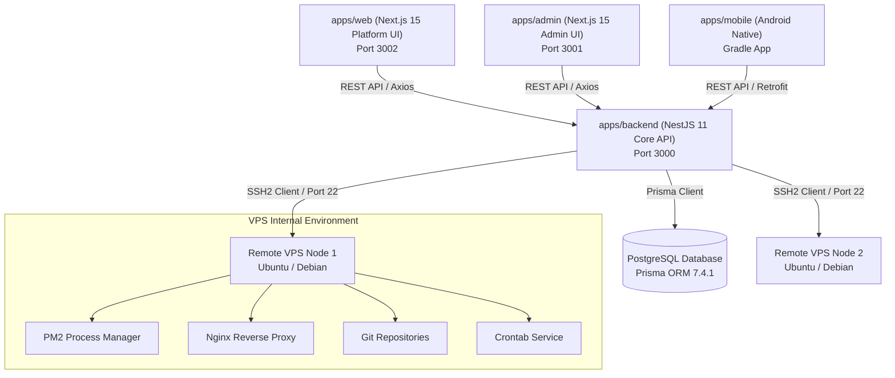

# CLOUDPULSE CURRENT ARCHITECTURE

**Document Version:** 1.0.0  
**Updated:** March 2026

---

## 1. System Overview

CloudPulse is structured as a TypeScript/Kotlin monorepo managed by `pnpm` workspaces and `TurboRepo`. The platform connects to remote Linux VPS instances via SSH to inspect, manage, and orchestrate server infrastructure, web applications, background processes, domains, and database backups.

---

## 2. Component Topology



---

## 3. Layered Design in Backend (`apps/backend`)

The NestJS backend is organized into domain modules under `src/modules/`:

1. **API Layer Controllers:**
   - `VpsController`: Exposes REST endpoints for VPS fleet, PM2, SFTP, Crons, Terminal.
   - `ProjectsController`: Exposes REST endpoints for project CRUD, Git inspection, deployments, environment variables, Nginx generation, and webhooks.
   - `AuthController` & `UsersController`: Authentication and user management.
   - `AdminDashboardController` & `AdminNotificationsController`: Admin operations.

2. **Domain & Application Services:**
   - `VpsService`: Manages VPS metadata in database and orchestrates SSH operations.
   - `ProjectsService`: Handles project lifecycle, deployment logic, Git commands, `.env` file generation, and Nginx config generation.
   - `SshService`: Low-level SSH client wrapper using `ssh2` package for executing shell commands and parsing outputs.

3. **Infrastructure & Persistence:**
   - `PrismaService`: Connects to PostgreSQL using Prisma Client v7.
   - Models: `Vps`, `Project`, `Deployment`, `ProjectDomain`, `VpsMetricHistory`, `VpsCronJob`, `VpsBackup`, `ProjectWebhook`, `User`, `AuditLog`.

---

## 4. Current Execution & Data Flows

### 4.1 VPS Management Flow
```
[User on Web UI] -> Request /vps/:id/pm2 -> [NestJS VpsController]
  -> [VpsService] -> Find VPS record in DB
  -> [SshService] -> Open SSH2 Client connection (IP, Port, User, Pass/SSHKey)
  -> [Remote VPS] -> Execute 'pm2 jlist'
  -> [SshService] -> Parse JSON output
  -> [NestJS] -> Return process list to Web UI
```

### 4.2 Application Deployment Flow
```
[User triggers Deploy] -> POST /vps/:vpsId/projects/:projectId/deployments
  -> [ProjectsService]
  -> [SSH Command 1] -> cd /var/www/apps/:project && git fetch && git checkout :branch
  -> [SSH Command 2] -> pnpm install / npm install
  -> [SSH Command 3] -> pnpm build / npm run build
  -> [SSH Command 4] -> pm2 restart :pm2Name --update-env
  -> Save Deployment record in PostgreSQL
  -> Return status to Web UI
```

---

## 5. Architectural Deficiencies & Vulnerabilities

1. **Lack of Background Job Processing:**
   - Deployments run synchronously inside HTTP request execution. Long-running builds (`npm install`, `next build`) exceed HTTP timeout (15s/30s) and crash connections.
2. **Plaintext Credential Storage:**
   - `Vps.password` and `Vps.sshKey` are stored unencrypted in PostgreSQL.
3. **Mock Data Fallbacks in Production Code:**
   - Web frontend APIs catch errors and automatically return static fake arrays instead of alerting the user or throwing network errors.
4. **Missing Workspace Scoping:**
   - `Vps` and `Project` records have no user/workspace scoping in Prisma schema or NestJS guards.
