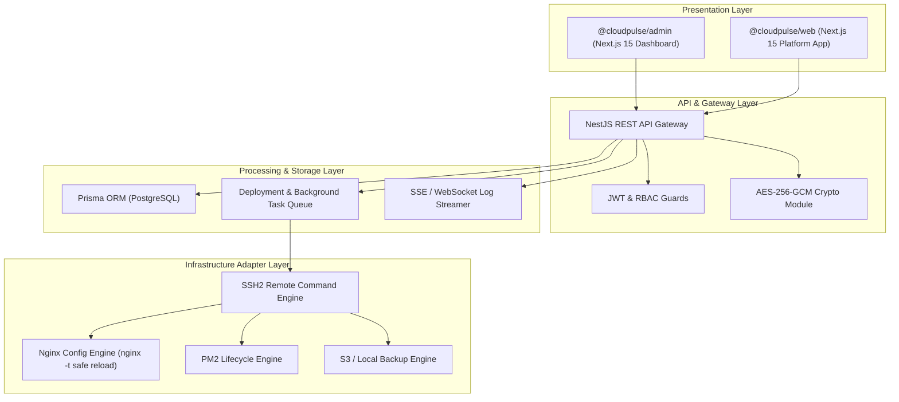

# CLOUDPULSE TARGET ARCHITECTURE

**Document Version:** 2.0.0  
**Target Standard:** Production-Ready Infrastructure Orchestration

---

## 1. Architectural Vision & Principles

CloudPulse Target Architecture establishes a secure, resilient, and real-time infrastructure platform.

### Core Architecture Principles
1. **Zero Fake Data in Production:** All frontend components consume real backend APIs. Fallbacks to mock data are strictly prohibited in production paths.
2. **Encrypted Credentials at Rest:** All SSH keys, passwords, and API tokens stored in PostgreSQL are encrypted using `AES-256-GCM` with key rotation support.
3. **Asynchronous Background Processing:** Heavy tasks (deployments, backups, SSL issuance, log streaming) are executed via asynchronous background job queues with Server-Sent Events (SSE) or WebSockets for live progress updates.
4. **Strict RBAC & Multi-Tenancy Scoping:** Every VPS, Project, Deployment, and Backup belongs to an Organization/Workspace or User, enforced at API guard level.
5. **Safe Nginx Configuration Control:** All Nginx modifications follow a strict pattern: Backup existing config -> Generate candidate config -> Validate with `nginx -t` over SSH -> Apply & Reload -> Rollback if validation fails.

---

## 2. Target Component Diagram



---

## 3. Security & Multi-Tenancy Architecture

### 3.1 Credential Encryption (`EncryptionService`)
- Algorithm: `AES-256-GCM` with random 16-byte initialization vector (IV) and authentication tag.
- Storage format in DB: `iv:authTag:encryptedPayload`.
- Master key configured via `ENCRYPTION_KEY` environment variable (32-byte hex string).

### 3.2 Authorization & Scope Guard
- `User` -> belongs to `Workspace` / `Organization`.
- `Vps` -> belongs to `Workspace` / `ownerId`.
- `Project` -> belongs to `Vps` & `Workspace`.
- Guard `WorkspaceGuard` validates that `req.user` has access to target `vpsId` and `projectId` before controller execution.

---

## 4. Deployment Engine Architecture

```
[User triggers Deploy] -> POST /vps/:vpsId/projects/:projectId/deployments
  │
  ├── 1. NestJS creates Deployment record in DB (status: RUNNING)
  ├── 2. Emits job to Background Queue
  └── 3. Returns Deployment ID immediately to Web UI (202 Accepted)

[Background Deployment Worker]
  │
  ├── 4. Open SSH stream to target VPS
  ├── 5. Step 1: Pre-flight check (disk space, SSH connectivity, Git access)
  ├── 6. Step 2: Git fetch & checkout target commit SHA
  ├── 7. Step 3: Install dependencies using lockfile
  ├── 8. Step 4: Run build commands (if configured)
  ├── 9. Step 5: Execute database migrations (if enabled)
  ├── 10. Step 6: Restart PM2 process with new environment variables
  ├── 11. Step 7: Perform HTTP health check on app port
  │       ├── Success -> Mark status SUCCESS, update active release tag
  │       └── Failure -> Auto-trigger Rollback to previous known good commit
  └── 12. Stream logs real-time via SSE/WebSocket channel: /deployments/:id/stream
```

---

## 5. Nginx & SSL Automation Architecture

1. **Config Templating:** Safe Mustache/Handlebars templates generating standard reverse-proxy blocks (HTTP -> HTTPS redirect, WebSocket headers, proxy_pass to app port).
2. **Safety Validation:**
   - Execute `nginx -t` via SSH before reloading.
   - If `nginx -t` fails, revert candidate config from backup file `/etc/nginx/sites-available/*.bak` and log full syntax error message.
3. **SSL Automation:**
   - Run `certbot --nginx -d domainName --non-interactive --agree-tos` over SSH.
   - Parse certificate expiration date and update `ProjectDomain.sslValidTo` and `sslStatus`.
